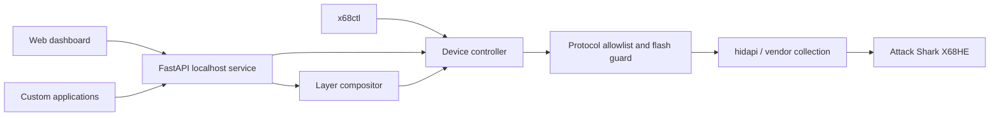

<p align="center">
  
</p>

# Attack Shark X68HE Lighting Control

Windows-first tools, a localhost API, and a web dashboard for controlling the lighting of
the wired Attack Shark X68HE keyboard (`3151:502D`). The project provides safe access to
built-in effects, capture-proven volatile whole-keyboard colour, and guarded static per-key
patterns.

The service is designed as a stable integration point for desktop applications, games,
automation tools, and future OpenRGB support. It keeps hardware ownership, frame pacing,
layer composition, and lighting-state restoration in one process.

> [!IMPORTANT]
> Arbitrary **volatile per-key animation is not currently supported**. On the tested
> keyboard revision, the confirmed per-key command writes to onboard flash. The project
> therefore permits occasional confirmed static patterns but never uses that command for
> animation.

## Project status

| Capability | Status | Notes |
| --- | --- | --- |
| Device detection and revision validation | Supported | VID/PID `3151:502D`; internal IDs `2270`, `2472`, and `2902` |
| Built-in lighting presets | Supported | Colour, brightness, speed, and mode option |
| Web control interface | Supported | Served locally at `http://127.0.0.1:8768/` |
| Volatile whole-keyboard colour | Supported | Capture-proven mode 21 / opcode `0x0E`, capped at 20 FPS |
| Multi-application colour layers | Supported | Priority, opacity, blend mode, TTL, and fade-out |
| Static per-key patterns | Supported with safeguards | Persistent USERPIC flash write, confirmation and cooldown required |
| Volatile per-key frames | Unsupported | No safe RAM-backed command has been proven |
| Native OpenRGB controller | Planned | Blocked until a volatile per-key protocol is verified |

Hardware validation has been completed on internal device ID `2902`. The connected unit
contains 66 physical LEDs despite the X68HE product name.

## Safety model

The HID command surface is deliberately narrow:

- Writes are accepted only after the keyboard reports an allowlisted internal device ID.
- Firmware, reset, bootloader, calibration, flash erase, macro, keymap, and Hall-effect
  configuration commands are outside the allowlist.
- Live output uses only the confirmed volatile whole-keyboard command.
- Static per-key writes require explicit acknowledgement, skip identical patterns, and
  enforce a ten-minute cooldown between different patterns.
- Streaming and layer sessions preserve the previous lighting state and restore it when
  control is released.
- A process-wide Windows mutex prevents two API instances from competing for the device.
- Other lighting software is never terminated automatically; a conflicting owner produces
  a device-busy error.

## Requirements

- Windows 10 or Windows 11
- Python 3.12
- A wired Attack Shark X68HE
- The vendor-defined HID collection on interface 2, usage page `0xFFFF`, usage `2`

Close Attack Shark Driver, Sharkfin, OpenRGB, or any other process using the keyboard's
vendor HID interface before starting this service.

## Quick start

Clone the repository and create an isolated environment:

```powershell
git clone https://github.com/diogor0d/attack-shark-api.git
cd attack-shark-api
py -3.12 -m venv .venv
.\.venv\Scripts\python.exe -m pip install -e ".[dev]"
```

Confirm that the keyboard is detected without changing its state:

```powershell
.\.venv\Scripts\x68ctl.exe probe
```

Start the local service:

```powershell
.\.venv\Scripts\x68ctl.exe serve
```

Then open:

- Web dashboard: <http://127.0.0.1:8768/>
- Interactive API documentation: <http://127.0.0.1:8768/docs>
- Health endpoint: <http://127.0.0.1:8768/health>

The server binds to `127.0.0.1:8768` by default. Use `x68ctl serve --port PORT` to select
another local port.

## Web dashboard

The bundled interface is dependency-free and served by the same FastAPI process. It
provides:

- connection, identity, revision, ownership, and capability status;
- a physical 66-key layout matching the keyboard chassis;
- built-in preset controls;
- a visual static per-key pattern editor with explicit flash-write confirmation;
- live whole-keyboard layer creation and active-source management; and
- a compact API reference for application developers.

The interface and public API share the same validation, ownership, rate limits, and state
restoration logic.

## Command-line interface

| Command | Purpose |
| --- | --- |
| `x68ctl probe` | Read identity, revision, capabilities, and the LED map |
| `x68ctl set-preset MODE` | Select a safe built-in lighting effect |
| `x68ctl demo` | Run a bounded volatile hue cycle and restore the previous state |
| `x68ctl set-custom` | Write one explicitly confirmed static per-key pattern |
| `x68ctl serve` | Start the dashboard, REST API, and WebSocket endpoints |

Set a built-in static colour:

```powershell
.\.venv\Scripts\x68ctl.exe set-preset static `
  --color '#00ff80' `
  --brightness 4 `
  --speed 2
```

Run a ten-second volatile lighting demo:

```powershell
.\.venv\Scripts\x68ctl.exe demo --fps 20 --duration 10
```

The demo captures the current lighting state before acquiring the device and restores it
on completion or interruption.

## Application integration

The REST and WebSocket interfaces remain available when the dashboard is not open.
Applications should use a unique `source_id` and one or more stable `layer_id` values.

### Important endpoints

| Method | Endpoint | Purpose |
| --- | --- | --- |
| `GET` | `/v1/devices` | List supported connected devices |
| `GET` | `/v1/devices/{device_id}` | Read identity, capabilities, limits, owner, and LED map |
| `GET` | `/v1/devices/{device_id}/lighting/state` | Read the current built-in lighting state |
| `PUT` | `/v1/devices/{device_id}/lighting/preset` | Apply a built-in effect |
| `PUT` | `/v1/devices/{device_id}/lighting/custom` | Commit a guarded static per-key pattern |
| `GET` | `/v1/devices/{device_id}/lighting/global-layers` | Inspect active global-colour layers |
| `PUT` | `/v1/devices/{device_id}/lighting/global-layers/{source_id}/{layer_id}` | Create or update a layer |
| `DELETE` | `/v1/devices/{device_id}/lighting/global-layers/{source_id}/{layer_id}` | Remove one layer |
| `DELETE` | `/v1/devices/{device_id}/lighting/global-layers/{source_id}` | Release every layer owned by a source |
| `WS` | `/v1/devices/{device_id}/lighting/global-layers/{source_id}/stream` | Maintain low-latency application layers |
| `WS` | `/v1/devices/{device_id}/lighting/global-stream` | Stream one whole-keyboard RGB colour |

The legacy per-key frame and stream routes remain fail-closed and report that volatile
per-key output is unsupported.

### Built-in preset example

```powershell
Invoke-RestMethod -Method Put `
  -Uri http://127.0.0.1:8768/v1/devices/x68he/lighting/preset `
  -ContentType application/json `
  -Body '{"mode":"static","color":"#00ff80","brightness":4,"speed":2,"option":0}'
```

### Shared lighting layers

Layers let independent applications cooperate without repeatedly stealing the HID device.
Higher priorities render over lower priorities; newer updates win ties. Supported blend
modes are `replace`, `alpha`, and clamped `add`.

Create a persistent base colour:

```powershell
Invoke-RestMethod -Method Put `
  -Uri http://127.0.0.1:8768/v1/devices/x68he/lighting/global-layers/game/base `
  -ContentType application/json `
  -Body '{"color":"#2020ff","priority":0}'
```

Add a one-second notification that fades over its final 300 milliseconds:

```powershell
Invoke-RestMethod -Method Put `
  -Uri http://127.0.0.1:8768/v1/devices/x68he/lighting/global-layers/my-app/alert `
  -ContentType application/json `
  -Body '{"color":"#ff0000","priority":200,"ttl_ms":1000,"fade_out_ms":300}'
```

Release every layer owned by that application:

```powershell
Invoke-RestMethod -Method Delete `
  -Uri http://127.0.0.1:8768/v1/devices/x68he/lighting/global-layers/my-app
```

The service emits HID data only when the composed colour changes, limits fade updates to
20 FPS, and restores the saved keyboard state after the final layer disappears.

### Static per-key patterns

> [!WARNING]
> This operation writes USERPIC slot 0 in keyboard flash. It is suitable for occasional
> static profiles, not animation.

```powershell
.\.venv\Scripts\x68ctl.exe set-custom `
  --row '0=#ff0000' `
  --row '1=#00ff00' `
  --key 'space=#0000ff' `
  --background '#000000' `
  --confirm-flash-write
```

Key names come from the device metadata's `led_map`. Individual `--key` values override a
colour assigned with `--row`.

## Architecture



The API process owns live arbitration. Superseded colour updates are discarded instead of
building latency, and only the composed output reaches the HID transport.

## Protocol and hardware notes

The implementation is based on controlled USB captures, the installed vendor driver's
behavior, and public ROYUAN protocol information. It does not copy Sharkfin source code.

Confirmed behavior on internal ID `2902`:

- `0x07`: built-in lighting parameters;
- `0x0E`: volatile whole-keyboard RGB used by mode 21;
- `0x0C`: paged USERPIC data stored in flash; and
- `0x0D`: mode-22 spectrum data, retained only as a research probe.

The mode-22 reports describe a firmware spectrum representation rather than arbitrary LED
frames. The `SET_USERGIF 0x12` family is also unsuitable: it targets onboard animation on
other ROYUAN layouts and is not advertised by the known X68HE revisions.

Detailed evidence and remaining work are maintained in:

- [Capture guide](docs/capture-guide.md)
- [Protocol notes](docs/protocol.md)
- [OpenRGB integration path](docs/openrgb.md)

## Development

Install the development dependencies and run the complete checks:

```powershell
.\.venv\Scripts\python.exe -m pip install -e ".[dev]"
.\.venv\Scripts\python.exe -m pytest
.\.venv\Scripts\python.exe -m ruff check .
.\.venv\Scripts\python.exe -m ruff format --check .
```

The test suite covers packet checksums, revision allowlisting, protocol guards, the physical
LED map, preset validation, ownership, frame dropping, layer composition, state restoration,
the API, and dashboard asset delivery.

### Repository layout

```text
src/attack_shark_x68he/   Python package, API, controller, compositor, and dashboard
tests/                    Unit and API tests with sanitized fixtures
tools/                    Capture analysis and bounded hardware research utilities
docs/                     Protocol evidence, capture procedure, and OpenRGB roadmap
```

Contributions involving new hardware commands should include sanitized capture-derived
fixtures and tests. Never commit raw USB captures: they can contain unrelated device traffic.

## Security and privacy

This service is intentionally local-only and has no authentication layer. Do not bind it to
a LAN address, expose it through a reverse proxy, or publish port `8768` to the internet.

Raw captures, environment files, private keys, build artifacts, caches, and local virtual
environments are excluded from Git. See [SECURITY.md](SECURITY.md) for vulnerability
reporting and the project's security boundary.

## OpenRGB roadmap

Native OpenRGB work remains gated on a stable volatile per-key protocol. The OpenRGB SDK
cannot add hardware detection by itself, and the X68HE must not be attached blindly to the
existing Attack Shark K86/Epomaker controller because related ROYUAN products use different
layouts and can reuse opcodes with different semantics.

## License

No license has been selected yet. Public visibility alone does not grant permission to copy,
modify, or redistribute the code. Add an explicit license before inviting redistribution or
packaging by third parties.

## Disclaimer

This is an independent interoperability project. It is not affiliated with or endorsed by
Attack Shark, ROYUAN, Sharkfin, or OpenRGB. Hardware behavior can differ between revisions;
use the software only with supported device IDs and at your own risk.
